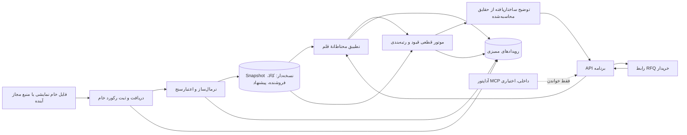
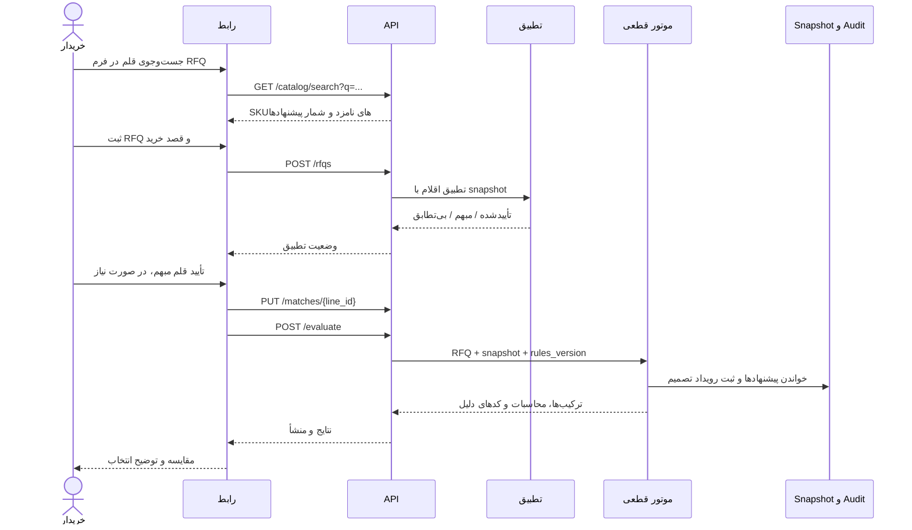

# معماری «ترب‌بیزینس» — فاز ۱

**وضعیت:** طرح اجرایی برای دمو؛ ۱۴۰۵/۰۶/۲۵ (۲۰۲۶-۰۹-۱۶)  
**دامنه:** کانسپت مستقل نمونه‌کار، نه محصول یا دادهٔ رسمی ترب. این سند قرارداد پیاده‌سازی است، نه ادعای استقرار.  
**مرجع محصول:** [برنامهٔ اصلی](00-master-plan.md)، [مشخصات محصول](01-product-spec.md)، [بک‌لاگ](06-feature-backlog.md).

## ۱. هدف و مرز

[آگهی AI Product Engineer ترب](https://jobs.torob.com/ai-product-engineer) مسیر `crawl offers → normalize messy data → rank by user intent → explain the best choice` و ویدیوی حداکثر پنج دقیقه را بیان می‌کند. این معماری همان مسیر را برای یک RFQ دو یا سه قلمی در دو دستهٔ اداری/IT طراحی می‌کند. دادهٔ دمو، ۵ تا ۱۰ فروشنده و پیشنهادهای **ساختگی و صریحاً برچسب‌خورده** است؛ واردسازی رکوردهای خام، مرحلهٔ دریافت پیشنهاد را شبیه‌سازی می‌کند و نباید «خزش فروشگاه‌های واقعی» نامیده شود. اتصال خزندهٔ واقعی فقط برای منبع مجاز و با ثبت زمان/آدرس/شرایط برداشت فعال می‌شود. MCP و عامل‌های خودمختار در آگهی شرط صریح نیستند؛ طراحی آن‌ها در این سند مسیر گسترش است.

خروجی MVP «پیشنهاد برای بررسی خریدار» است. هیچ خرید، رزرو قیمت، تماس با فروشنده، تأیید فاکتور یا تضمین موجودی رخ نمی‌دهد. «بهترین» فقط به معنی رتبهٔ اول **میان ترکیب‌های کامل و واجد شرایط در snapshot مشخص** و طبق ترجیح اعلام‌شدهٔ کاربر است، نه بهترین قیمت بازار.

## ۲. اجزا و جریان داده

برای دمو یک برنامهٔ واحد با ماژول‌های جدا و پایگاه سبک مانند SQLite کافی است؛ موتور تصمیم یک تابع خالص روی `RFQ + snapshot + نسخهٔ قواعد` است. کلاینت فقط فرم، رفع ابهام و نمایش نتیجه را بر عهده دارد؛ قیمت، صلاحیت یا ترتیب را خودش محاسبه نمی‌کند. این مرز، بازتولید نتیجه و ممیزی را ممکن می‌کند.

## ۳. مدل دادهٔ حداقلی و منشأ

| موجودیت | فیلدهای لازم | قاعده |
| --- | --- | --- |
| `DatasetSnapshot` | `id`, `version`, `captured_at`, `kind=synthetic|permitted_crawl|vendor_feed`, `rules_version`, `content_hash` | منتشرشده و تغییرناپذیر؛ هر اجرا به یک نسخه قفل می‌شود. |
| `RawOfferRecord` | `id`, `snapshot_id`, `source_label`, `source_record_id?`, `source_url?`, `generated_at?`, `observed_at?`, `raw_title`, `raw_price_text`, `raw_unit_text`, `raw_terms`, `payload_hash`, `permission_note?` | متن ورودی حفظ می‌شود تا تبدیل‌ها قابل‌ردیابی باشند. دادهٔ ساختگی فقط `generated_at` و دادهٔ واقعی فقط `observed_at` دارد؛ fixture با `source_label=synthetic_fixture` مشخص می‌شود. |
| `CatalogItem` | `id`, `category`, `canonical_name`, `brand?`, `specs`, `base_unit`, `aliases` | شناسهٔ کالای مشخص با ویژگی‌های لازم برای جلوگیری از تطبیق اشتباه. |
| `Vendor` | `id`, `display_name`, `synthetic`, `shipping_rule`, `minimum_order_irr?` | هزینهٔ ارسال و حداقل مبلغ سفارش در سطح فروشنده محاسبه می‌شود. |
| `NormalizedOffer` | `id`, `raw_record_id`, `catalog_item_id?`, `vendor_id`, `package_size_base`, `package_price_irr`, `tax_status`, `min_packages`, `package_step`, `stock_packages?`, `lead_days?`, `invoice_status=unknown|declared_yes|declared_no|verified_yes|verified_no`, `valid_at`, `normalization_status`, `warnings` | مقدار نامعلوم `null` می‌ماند؛ قیمت و شرایط ساخته نمی‌شوند. وضعیت‌های `verified_*` به شاهد مستقل نیاز دارند و در fixture اولیه وجود ندارند. تبدیل واحد و قیمت به رکورد خام برمی‌گردند. |
| `RFQ` / `RFQLine` | `id`, `buyer_session_id`, `lines[]`, `query_text`, `qty_base`, `requested_specs`, `budget_irr?`, `max_lead_days?`, `requires_declared_invoice`, `preference=lowest_cost|fastest_delivery`, `created_at` | یک نقش خریدار نمایشی؛ اقلام خالی/تعداد صفر/واحد ناسازگار در API رد می‌شوند. «فاکتور تأییدشده» در MVP قابل‌درخواست نیست. |
| `MatchDecision` | `rfq_line_id`, `candidate_catalog_ids`, `selected_catalog_id?`, `status=confirmed|ambiguous|unmatched`, `method`, `evidence` | تطبیق مبهم یا بی‌تطابق به خریدار بازمی‌گردد؛ هیچ نگاشت حدسی وارد رتبه‌بندی نمی‌شود. |
| `RecommendationRun` / `Combination` | `id`, `rfq_id`, `snapshot_id`, `algorithm_version`, `input_hash`, `preference`, `search_exhaustive`, `assignments[]`, `vendor_subtotals`, `shipping_total_irr`, `total_irr`, `max_lead_days`, `rank`, `reason_codes` | هر assignment شناسهٔ قلم/پیشنهاد، تعداد بستهٔ خریدنی، پوشش واقعی و هزینه را نگه می‌دارد. |
| `AuditEvent` | `id`, `occurred_at`, `run_id?`, `event_type`, `actor`, `input_refs`, `output_refs`, `reason_codes`, `rules_version` | append-only؛ مقادیر حساس نشست یا متن آزاد کاربر حداقلی نگه داشته می‌شود. |

مبنای پول **ریالِ صحیح (`IRR`)** است. fixture فقط `IRR` و تومان با تبدیل ثابت `۱ تومان = ۱۰ ریال` را می‌پذیرد؛ واحد پول ناشناخته یا مبلغ نامعتبر به رکورد `rejected` می‌رسد. تبدیل ارزی شناور در MVP وجود ندارد. زمان ثبت/اعتبار هر پیشنهاد همراه snapshot نمایش داده می‌شود؛ قیمت «زنده» تلقی نمی‌شود. قیمت بسته در fixture شامل مالیات اعلام‌شده است؛ رکوردی با وضعیت مالیات نامعلوم، در مقایسهٔ هزینهٔ کل واجد شرایط نیست. واحد پایهٔ هر SKU صریح است، مانند `عدد` یا `بستهٔ ۵۰۰ برگی`؛ تبدیل بین واحدهای ناسازگار ممنوع است.

## ۴. دریافت، نرمال‌سازی و تطبیق

1. **دریافت:** واردکنندهٔ fixture یا خزندهٔ منبع مجاز، متن خام و metadata را به صورت تغییرناپذیر ثبت می‌کند. کلید idempotency از `source_label + source_id/URL + payload_hash` ساخته می‌شود. خطای شبکه یا parse رکوردی را بی‌صدا حذف نمی‌کند و snapshot ناقص منتشر نمی‌شود.
2. **نرمال‌سازی:** ارقام فارسی/عربی، نویسه‌های یکسان، جداکنندهٔ قیمت، تومان/ریال و عبارت بسته‌بندی به فیلد ساختاریافته تبدیل می‌شوند. نمونه: «کاغذ A4، کارتن ۵ بسته، هر کارتن ۲٬۴۰۰٬۰۰۰ تومان» → `package_size_base=5 بستهٔ ۵۰۰برگی`, `package_price_irr=24,000,000`. متن خام و قاعدهٔ تبدیل حفظ می‌شوند. ویژگی‌های کلیدی مثل اندازه، ظرفیت و مدل باید با کاتالوگ بخوانند؛ شباهت نام به‌تنهایی کافی نیست.
3. **اعتبارسنجی:** قیمت مثبت، بسته/گام صحیح، فروشندهٔ شناخته‌شده، شرایط ارسال قابل‌محاسبه و زمان معتبر لازم‌اند. قیمت گمشده، واحد مبهم، موجودی نامعلوم، زمان تحویل نامعلوم یا هزینهٔ ارسال نامعلوم با کد علت ثبت می‌شود و پیشنهاد وارد رتبه‌بندی نمی‌شود؛ هر دو قصد رتبه‌بندی از زمان تحویل استفاده می‌کنند. نامعلوم به صفر یا «بله» تبدیل نمی‌شود.
4. **جست‌وجو و تطبیق RFQ:** خریدار داخل فرم برای هر قلم عبارت و مشخصات می‌نویسد؛ جست‌وجوی کاتالوگ، SKUهای نامزد و شمار پیشنهادهای snapshot برای هر SKU را نشان می‌دهد، بی‌آنکه قیمت قلم مبهم را قطعی جلوه دهد. ابتدا نگاشت قطعی ویژگی/alias؛ در صورت چند SKU سازگار، فهرست گزینه‌ها و تفاوت مشخصات نشان داده می‌شود تا خریدار تأیید کند. پس از انتخاب SKU، پیشنهادهای همان SKU بازیابی و سپس قیود روی آن‌ها اعمال می‌شود. LLM می‌تواند فقط نامزد پیشنهاد دهد؛ `selected_catalog_id` بدون تأیید صریح یا قاعدهٔ قطعی ثبت نمی‌شود. اقلام تکراریِ همان SKU پیش از بهینه‌سازی تجمیع و شناسه‌های خط اصلی برای نمایش حفظ می‌شوند تا موجودی دوبار مصرف نشود. بنابراین تعامل اصلی همان `query → candidate items/offers → hard filter → basket rank → explanation` است، در قالب یک درخواست خرید چندقلمی.

## ۵. موتور انتخاب و رتبه‌بندی چندقلمی

**تعریف امکان‌پذیری.** برای هر قلم و پیشنهاد هم‌SKU، مقدار در واحد پایه محاسبه می‌شود. اگر نیاز `q`، اندازهٔ بسته `p`، حداقل بسته `m` و گام خرید `s` باشد، کوچک‌ترین تعداد بستهٔ مجاز چنین است:

`n = m + s × ceil(max(0, ceil(q/p) - m) / s)`

پس `n × p` مقدار پوشش و `n × package_price_irr` هزینهٔ قلم است؛ اضافه‌خرید آشکار نمایش داده می‌شود. `stock_packages` باید معلوم و دست‌کم `n` باشد. برای هر خط دقیقاً یک پیشنهاد انتخاب می‌شود؛ تقسیم یک قلم بین دو فروشنده در MVP موکول است. هر ترکیب فروشنده‌ها پس از انتخاب همهٔ خطوط ارزیابی می‌شود: جمع اقلام هر فروشنده باید به `minimum_order_irr` او برسد؛ هزینهٔ ارسال بر اساس همان subtotal، مقصد ثابت دمو و قانون ثبت‌شدهٔ فروشنده **یک‌بار برای هر فروشنده** محاسبه می‌شود. جمع نهایی برابر مجموع هزینهٔ بسته‌های انتخابی + مجموع ارسال فروشندگان است. تخفیف‌های شرطی/کوپن‌های نامدل‌شده در این جمع وارد نمی‌شوند.

**قیود سخت پیش از رتبه:** تطبیق تأییدشده، پوشش همهٔ اقلام، موجودی کافی، حداقل سفارش فروشنده، قیمت، ارسال و زمان تحویل معلوم، `invoice_status=declared_yes|verified_yes` اگر کاربر فیلتر «فاکتور اعلام‌شده» را خواسته باشد، حداکثر زمان تحویل اگر تعیین شده باشد، و بودجه اگر تعیین شده باشد. `declared_no` و `unknown` از فیلتر فاکتور عبور نمی‌کنند؛ این فیلتر راستی‌آزمایی فاکتور را تضمین نمی‌کند. `lead_days` ترکیب، بیشینهٔ زمان اعلامی اقلام است. زمان نامعلوم حتی بدون قید زمانی از رتبه‌بندی کنار می‌رود، چون در هر دو کلید مرتب‌سازی حضور دارد. بودجه روی **جمع نهایی با ارسال** اعمال می‌شود.

**قصد کاربر و ترتیب قطعی.** پس از فیلتر سخت، `lowest_cost` با کلید `(total_irr, max_lead_days, vendor_count, sorted_offer_ids)` و `fastest_delivery` با `(max_lead_days, total_irr, vendor_count, sorted_offer_ids)` به صورت صعودی مرتب می‌شوند. تفاوت کلید اول دو حالت، اثر مستقیم قصد اعلام‌شدهٔ کاربر است؛ کلید آخر تساوی‌ها را پایدار می‌کند. «فروشندهٔ معتبرتر» وزن ندارد چون امتیاز راستی‌آزمایی‌شده نداریم. توضیح هر رتبه از اجزای همین tuple، محاسبهٔ هزینه و `reason_codes` ساخته می‌شود، نه از متن آزاد مدل. اگر LLM جمله‌بندی کند، فقط از payload ساختاریافته با شناسهٔ پیشنهاد و اعداد محاسبه‌شده استفاده می‌کند و خروجی آن پیش از نمایش با دادهٔ مبنا تطبیق داده می‌شود؛ قالب ثابت fallback همیشه موجود است.

برای fixture کوچک، همهٔ انتخاب‌های یک پیشنهاد برای هر قلم شمرده می‌شود و تمام ترکیب‌های ممکن آزموده می‌شوند؛ بنابراین رتبهٔ اول فقط در **فضای متناهیِ پیشنهادهای snapshot** دقیق است. گیت ایمنی `max_enumerated_combinations=10,000` دارد. اگر از این سقف گذشت، اجرا با `SEARCH_LIMIT` پایان می‌یابد و هیچ برچسب «بهترین» یا رتبهٔ ناقص برنمی‌گرداند؛ بهینه‌ساز بزرگ‌مقیاس، تولید نامزد محدود و ادعای تقریب بعداً طراحی می‌شوند. در صورت نبود ترکیب کامل، پاسخ `no_full_coverage` شامل اقلام بی‌پیشنهاد، قیود ردکننده و نمونه‌های ردشده است؛ ترکیب ناقص به‌صورت «پیشنهاد خرید» رتبه نمی‌گیرد.

## ۶. قرارداد API و مرز رابط

| Endpoint | کارکرد و پاسخ لازم |
| --- | --- |
| `GET /api/datasets/active` | شناسه/نسخه/تاریخ snapshot، نوع داده و برچسب ساختگی‌بودن. |
| `GET /api/catalog/search?q=...&snapshot_id=...` | نامزدهای SKU با مشخصات متمایزکننده و شمار پیشنهادهای همان snapshot؛ هیچ تطبیق مبهم را خودکار نهایی نمی‌کند. |
| `POST /api/rfqs` | اعتبارسنجی فرم و ثبت RFQ؛ `rfq_id` و خطاهای فیلدی. |
| `GET /api/rfqs/{id}/matches` | وضعیت هر قلم، نامزدهای کاتالوگ و دلیل ابهام/بی‌تطابق. |
| `PUT /api/rfqs/{id}/matches/{line_id}` | ثبت انتخاب صریح SKU برای قلم مبهم؛ انتخاب باید در نامزدهای سازگار باشد. |
| `POST /api/rfqs/{id}/evaluate` | قفل snapshot و اجرای موتور؛ `run_id`, `status`, `search_exhaustive`. اجرای مجدد با همان RFQ/snapshot/rules خروجی همسان می‌دهد. |
| `GET /api/runs/{id}` | ترکیب‌ها با `rank`, `assignments`, `coverage`, subtotal/ارسال/جمع، زمان، `reason_codes`, `excluded_reasons`, `offer_ids` و metadata منشأ. |
| `GET /api/offers/{id}/provenance` | متن خام منتخب، تبدیل‌های اعمال‌شده، زمان، برچسب منبع و هشدارها؛ نشانی منبع فقط اگر مجاز باشد. |

نمونهٔ حداقلی درخواست ارزیابی: `{"snapshot_id":"demo-v1","preference":"lowest_cost"}`. پاسخ موفق باید `data_kind:"synthetic"`, `algorithm_version`, `input_hash` و `search_exhaustive:true` داشته باشد. پاسخ `422` برای ورودی نادرست یا تطبیق حل‌نشده، `409` برای snapshot تغییرکرده، و نتیجهٔ دامنه‌ای `no_full_coverage` برای نبود ترکیب کامل است. رابط کاربر سه صفحه/حالت دارد: فرم RFQ، رفع ابهام تطبیق، مقایسه با ریزمحاسبه و منشأ. در صفحهٔ نخست و نتایج، برچسب دادهٔ ساختگی و تاریخ snapshot همیشه دیده می‌شود.

## ۷. ممیزی و طراحی اختیاری MCP

رویدادهای `raw_record_imported`, `offer_normalized`, `offer_rejected`, `match_confirmed`, `run_started`, `combination_rejected`, `run_completed` با شناسهٔ ورودی/خروجی و نسخهٔ قاعده ثبت می‌شوند. برای هر نتیجه می‌توان از assignment به پیشنهاد نرمال، رکورد خام و متن قیمت/شرایط رسید. `input_hash` از RFQ استانداردشده، انتخاب‌های تطبیق، snapshot و نسخهٔ قواعد ساخته می‌شود. رویدادها append-only هستند؛ تصحیح داده snapshot تازه می‌سازد، تاریخچه را بازنویسی نمی‌کند. در دمو شناسهٔ نشست ساختگی کافی است و دادهٔ تماس شخصی در لاگ تصمیم ذخیره نمی‌شود.

اگر در فاز بعد عامل داخلی برای کاوش داده لازم شد، یک **آداپتور MCP فقط‌خواندنی** روی همین سرویس کاربردی می‌نشیند: `list_catalog_items`, `get_offers`, `preview_rfq`, `get_run_explanation`. `preview_rfq` محاسبهٔ خالص و موقت است و RFQ یا نتیجهٔ ثبت‌شده را تغییر نمی‌دهد. هر پاسخ schema نسخه‌دار، `snapshot_id`, `data_kind`, `offer_ids`, `as_of` و `reason_codes` دارد؛ ورودی با schema محدود و تعداد رکورد سقف‌دار اعتبارسنجی می‌شود. عامل حق تغییر قیمت/تطبیق/رتبه، ساخت فروشنده یا اجرای سفارش ندارد. قرارداد REST منبع حقیقت می‌ماند و MCP فقط راه دسترسی دیگری به همان محاسبات است. MCP عمومی/ERP، دسترسی به دادهٔ اختصاصی، A2A و ابزار write تا روشن‌شدن مجوز داده، احراز هویت، کنترل اختیار و نیاز واقعی کاربر موکول‌اند.

## ۸. تصمیم‌های ساخت، خطاها و گیت خروج فاز ۱

| اکنون می‌سازیم/مشخص می‌کنیم | موکول و علت |
| --- | --- |
| fixture خام نسخه‌دار؛ نرمال‌سازی قابل‌ردیابی؛ کاتالوگ محدود؛ RFQ دستی؛ رتبه‌بندی قطعی با ارسال/حداقل سفارش؛ توضیح ساختاریافته؛ API و audit پایه | خزندهٔ فروشگاه واقعی تا بررسی مجوز و شرایط برداشت؛ دادهٔ دمو نباید به نام دادهٔ واقعی معرفی شود. |
| واردکنندهٔ raw offer که بتواند بعداً پشت خزنده قرار گیرد | MCP اجرایی/بیرونی، عامل مذاکره/خرید، checkout، پرداخت، امتیاز اعتماد، بنچمارک بازار، CSV/OCR و نقش‌های متعدد؛ هیچ‌کدام برای مسیر پنج دقیقه‌ای لازم نیست. |

خطاهای مورد انتظار: تطبیق مبهم، SKU بدون پیشنهاد، قیمت/واحد/ارز نامعتبر، ارسال یا موجودی نامعلوم، بسته‌بندی ناسازگار، حداقل سفارش تأمین‌نشده، نقض فاکتور/زمان/بودجه، snapshot ناقص یا تغییرکرده، سقف جست‌وجو و نبود پوشش کامل. هر مورد کد علت و اقدام روشن در UI دارد؛ خطای ورودی یا منبع به قیمت صفر، موجودی نامحدود، یا نتیجهٔ ظاهراً کامل تبدیل نمی‌شود.

**گیت خروج قابل‌بررسی:**

1. روی fixture ثابتِ دقیقاً دو دسته و ۵ تا ۱۰ فروشندهٔ ساختگی، حداقل یک RFQ دو‌قلمی دو ترکیب کامل واجد شرایط تولید کند؛ جمع هر ترکیب با تعداد بستهٔ قابل‌خرید، حداقل سفارش و ارسال یک‌بارهٔ هر فروشنده دستی بازحساب شود.
2. تغییر `lowest_cost` به `fastest_delivery` در fixture دارای trade-off ترتیب را طبق tuple عوض کند؛ تساوی کامل با شناسهٔ پیشنهاد پایدار بماند. دو اجرای ورودی و snapshot یکسان، `input_hash`، محاسبات و ترتیب یکسان بدهند.
3. سناریوهای قلم مبهم، بدون تطبیق، قیمت نامعلوم، قید فاکتور/تحویل، کمبود موجودی و نبود پوشش کامل، علت درست نشان دهند و هیچ ترکیب ناقص/نامعتبر را «بهترین» ننامند.
4. برای هر مبلغ و ادعای توضیح، مسیر `run → assignment → normalized offer → raw record` و تاریخ snapshot قابل‌بازبینی باشد؛ متن توضیح فقط از اعداد/کدهای محاسبه‌شده مشتق شود.
5. دمو در ≤۵ دقیقه RFQ، رفع یک ابهام، مقایسه و چرایی انتخاب را نشان دهد. اگر نمایش «crawl» ادعا می‌شود، دست‌کم یک منبع واقعیِ مجاز با provenance جدا ارائه شود؛ تا آن زمان به‌روشنی «واردسازی پیشنهادهای خام ساختگی» گفته شود.
