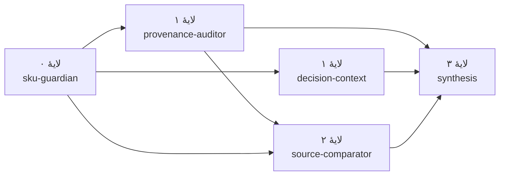

# هستهٔ تصمیم و مرز عامل‌ها — فاز ۲

**وضعیت:** هستهٔ قاعده‌محور آفلاین اجرا و آزموده شده است؛ هیچ مدل زبانی یا عامل خرید خودمختار در این نسخه ادعا نمی‌شود.  
**مرجع:** [اسپک](01-product-spec.md)، [معماری](02-architecture.md)، [چالش رسمی ترب](https://jobs.torob.com/ai-product-engineer).

## مسیر اجرایی

| بخش | ورودی و خروجی | اختیار |
| --- | --- | --- |
| واردکننده و نرمال‌ساز | سند خام نسخه‌دار → پیشنهاد نرمال یا رکورد قرنطینه‌شده با کد دلیل | فقط تبدیلِ دارای شاهد؛ مقدار نامعلوم را حدس نمی‌زند. |
| جست‌وجو/تطبیق RFQ | عبارت کالا و تعداد → SKUهای نامزد؛ انتخاب قطعی یا «نیازمند رفع ابهام» | تطبیق دقیق یکتا خودکار است؛ نتیجهٔ مبهم برای کاربر می‌ماند. |
| موتور انتخاب | RFQ حل‌شده + snapshot → سبدهای کامل، هزینه، زمان و دلایل رد | محاسبهٔ قطعی؛ هیچ سفارش یا تماس بیرونی ندارد. |
| توضیح | رتبه و اجزای محاسبه → دلیل ساختاریافته با شناسهٔ پیشنهاد | از دادهٔ محاسبه‌شده مشتق می‌شود؛ ادعای بازار یا تأیید فروشنده اضافه نمی‌کند. |

هر اجرا به شناسهٔ snapshot و نسخهٔ الگوریتم گره می‌خورد. `input_hash` بازتولید همان تصمیم را ممکن می‌کند و هر assignment شناسهٔ پیشنهاد و رکورد خام را همراه دارد. در این مرحله خروجی CLI ردّ تصمیم را نشان می‌دهد؛ ذخیرهٔ پایدار audit event برای فاز ساخت سرویس است.

## ارکستراسیون و مقیاس اجرای محلی

`AgentRuntime` گراف را به لایه‌های قابل‌اجرا compile می‌کند. در graph فعلی، `provenance-auditor` و `decision-context` بعد از `sku-guardian` مستقل‌اند و می‌توانند هم‌زمان اجرا شوند؛ `source-comparator` به هر دو مسیر لازم وابسته است و `synthesis` آخر اجرا می‌شود.

runtime پیش‌فرض سقف دو اجرای هم‌زمان دارد. این یک مدل scale-out توزیع‌شده نیست؛ برای همین نسخه، مقیاس‌پذیری یعنی کنترل concurrency کارهای read-only، حفظ ترتیب trace و جلوگیری از اشباع منابع. retry با `max_attempts` قابل تنظیم است، اما فقط برای agentهای بدون side effect و دارای `retry_safe` اجرا می‌شود. هر خطای حل‌نشده graph را fail-closed می‌کند تا artifact ناقص به رتبه‌بندی یا توضیح نرسد.

این مرز عمداً روشن است: queue بیرونی، worker توزیع‌شده و اجرای خرید هنوز ساخته نشده‌اند. در صورت اضافه‌شدن آن‌ها، همین execution plan می‌تواند ورودی scheduler شود و `run_id`، artifact lineage و quality gateها قرارداد مشاهده‌پذیری را حفظ کنند.

در fixture `demo-v1`، ۲۰ رکورد خام از دو قالب سند و شش فروشندهٔ ساختگی وارد می‌شود: ۱۱ پیشنهاد پذیرفته و ۹ رکورد با علت مشخص قرنطینه می‌شود. RFQ نمونه برای ۱۳ خودکار آبی و ۲ ماوس USB، با قصد کمترین هزینه ترکیب **۸۶۵٬۰۰۰ ریال / ۳ روز** و با قصد سریع‌ترین تحویل ترکیب **۱٬۱۵۰٬۰۰۰ ریال / ۱ روز** را اول می‌کند. این اعداد فقط نتیجهٔ دادهٔ ساختگی‌اند و ادعای قیمت بازار نیستند.

## معیار ارزیابی

- تبدیل ارقام فارسی/عربی و تومان/ریال، بسته/عدد و نام‌های متفاوت همان SKU باید روی fixture طلایی درست باشد؛ قیمت/واحد نامعلوم باید با کد علت قرنطینه شود.
- خرید ۱۳ عدد از بستهٔ ۱۰تایی با قیمت ۱۰۰٬۰۰۰ ریال و ارسال ۲۰٬۰۰۰ ریال باید ۲ بسته، ۷ عدد اضافه‌خرید و جمع ۲۲۰٬۰۰۰ ریال بدهد.
- تغییر قصد از کمترین هزینه به سریع‌ترین تحویل باید در fixture دارای بده‌بستان، برنده را عوض کند؛ تساوی باید با شناسهٔ پیشنهاد پایدار باشد.
- زمان، موجودی، ارسال، مالیات یا حداقل سفارش نامعلوم نباید «بهترین» کاذب بسازد. نبود پوشش کامل و رسیدن به سقف جست‌وجو باید صریح گزارش شود.
- توضیح هر نتیجه باید با شناسهٔ پیشنهاد، جمع هزینه و زمان همان نتیجه سازگار باشد. اجرای دوبارهٔ ورودی و snapshot یکسان باید نتیجهٔ یکسان بدهد.

## جایگاه AI و عامل خودمختار

در نسخهٔ بعدی، مدل می‌تواند **فقط نامزد استخراج/تطبیق** از متن نامرتب پیشنهاد دهد. خروجی آن باید schema محدود، شناسهٔ شاهد، درجهٔ اطمینان و امکان ارجاع به بازبینی انسانی داشته باشد؛ قیمت، فروشنده یا شرط تجاری تازه نمی‌سازد. قبولی آن نیازمند مقایسه با fixture طلایی و سنجش خطاهای «تطبیق اشتباه اما ظاهراً مطمئن» است. رتبه‌بندی و جمع هزینه همچنان قاعده‌محور می‌مانند.

نمونهٔ خرید خودکار تنها پس از تعریف policy قابل‌آزمایش است: سقف مبلغ/دوره، فهرست فروشندگان مجاز، بودجهٔ باقی‌مانده، زمان اعتبار snapshot، توقف اضطراری، تأیید انسان برای استثنا و رویدادهای append-only. تا آن زمان نه ابزار خرید وجود دارد و نه خروجی این هسته مجوز تراکنش است. MCP نیز مطابق معماری، آداپتور فقط‌خواندنیِ آینده است، نه پیش‌نیاز دمو.
