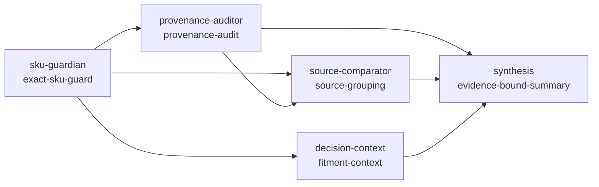

# ترب‌بیزینس: خرید سازمانی و مقایسهٔ پیشنهادها

این مخزن تجربهٔ خرید سازمانی برای جست‌وجو و مقایسهٔ پیشنهادهاست. [چالش AI Product Engineer ترب](https://jobs.torob.com/ai-product-engineer) بر گردآوری پیشنهاد، یکسان‌سازی دادهٔ نامرتب، رتبه‌بندی متناسب با نیاز کاربر و توضیح انتخاب تأکید دارد. این محصول مسیر دادهٔ خام تا پیشنهاد قابل‌ردیابی را در یک رابط محلی و یک runtime چند-agent قطعی اجرا می‌کند.

رابط از ویترین کالا شروع می‌شود: جست‌وجو و دسته‌بندی، کارت کالا، جزئیات پیشنهادهای پذیرفته‌شده، افزودن به فهرست چندقلمی و سپس مقایسهٔ تأمین‌کننده‌ها. صفحهٔ «خرید سازمانی» مسیر پیشنهادی برای شرکت‌ها و دارندگان پروانهٔ کسب را توضیح می‌دهد. این ساختار با بررسی [ویترین دیجی‌کالا بیزینس](https://b2b.digikala.com/) و [معرفی ثبت‌نام سازمانی دیجی‌کالا](https://www.digikala.com/landings/business-registration/) بازبینی شد؛ نشان، تصویر و محتوای آن سرویس استفاده نشده است.

## اجرای محلی

Python 3.11 یا بالاتر کافی است؛ وابستگی اجرایی بیرونی ندارد. از ریشهٔ مخزن:

```bash
PYTHONPATH=src python3 -m torob_business.server --port 8765
```

سپس [محیط محلی](http://127.0.0.1:8765) را باز کنید. سرور به‌طور پیش‌فرض فقط به `127.0.0.1` وصل می‌شود. کاتالوگ در SQLite محلی `data/torob_business.sqlite3` ساخته و با snapshot فعال همگام می‌شود؛ RFQها و نتایج اجرای رتبه‌بندی همچنان تا زمان بسته‌شدن فرایند در حافظه نگه داشته می‌شوند. مسیر دیتابیس را می‌توان با `--db PATH` تغییر داد. برای اجرای هسته بدون مرورگر:

اگر پورت ۸۷۶۵ را برای بازبینی این نسخه به کار می‌برید، نشانی [محیط در حال اجرا](http://127.0.0.1:8765/) است.

```bash
PYTHONPATH=src python3 -m torob_business.cli --trace
PYTHONPATH=src python3 -m torob_business.cli --preference fastest_delivery --trace
PYTHONPATH=src python3 -m torob_business.cli --search 'خودکار آبی'
PYTHONPATH=src python3 -m torob_business.cli --rfq examples/rfq_demo.json --json
PYTHONPATH=src python3 -m unittest discover -s tests -v
```

`--trace` برای هر پیشنهاد منتخب، متن قیمت و بسته‌بندی خام و گام‌های نرمال‌سازی را نشان می‌دهد. `--json` نتیجهٔ ساختاریافته، دلیل رتبه، شناسهٔ پیشنهادها و منشأ را برمی‌گرداند. برای آزمون دادهٔ دیگر در CLI از `--fixture PATH` استفاده کنید؛ ورودی فعلاً باید صریحاً `kind: synthetic` داشته باشد.

## معماری چند-agent قابل‌ممیزی

مسیر تحلیل کالا واقعاً به‌صورت یک گراف وابستگی اجرا می‌شود؛ نام «agent» در این پروژه فقط برچسب UI نیست. هر agent یک قرارداد محدود، skillهای قابل‌مشاهده، ورودی/خروجی مشخص و trace دارد. تصمیم‌های حساس SKU و منشأ در کد قطعی باقی می‌مانند تا هیچ قیمت، موجودی یا تطبیق مدل حدس زده نشود.



پنج agent فعلی در [`src/torob_business/agents.py`](src/torob_business/agents.py) این نقش‌ها را دارند:

- `sku-guardian`: فقط رکوردهای دیجی‌کالا با `match_status=exact` را وارد مقایسه می‌کند و مدل/ظرفیت متفاوت را مسدود می‌کند.
- `provenance-auditor`: وجود URL، زمان برداشت، عنوان خام و متن خام قیمت را بررسی می‌کند و وضعیت نامعلوم را نگه می‌دارد.
- `source-comparator`: گروه ترب و دیجی‌کالا را جدا نگه می‌دارد و تفاوت‌های نامعلوم را گزارش می‌کند.
- `decision-context`: زمینهٔ fitment و checklist خرید را از لایهٔ تصمیم محصول می‌گیرد.
- `synthesis`: فقط بر اساس artifactهای قبلی خلاصه می‌سازد و quality gateهای «بدون قیمت ساختگی»، «فقط SKU دقیق» و «منشأ ممیزی‌شده» را صادر می‌کند.

`AgentRuntime` ابتدا dependencyها را topological-sort می‌کند، cycle و dependency ناشناخته را رد می‌کند و graph را به لایه‌های پایدار تبدیل می‌کند. agentهای مستقل در هر لایه با `max_parallelism=2` اجرا می‌شوند، trace خروجی همچنان بر اساس ترتیب DAG مرتب می‌ماند و artifactهای لایهٔ قبل تنها ورودی لایهٔ بعد هستند. retry فقط با `max_attempts>1` و برای agentی که `retry_safe=True` دارد فعال می‌شود؛ خطای حل‌نشده اجرای graph را fail-closed می‌کند. برای هر اجرا `run_id` پایدار، plan، trace زمان‌دار، تعداد شواهد، artifactها و gateهای کیفیت تولید می‌شود. این طراحی سه قابلیت مهندسی AI را در مسیر واقعی محصول نشان می‌دهد: قرارداد ابزار/skill، ارکستراسیون قابل‌تکرار و observability قابل‌ممیزی. provider مدل زبانی فعلاً `None` است؛ اگر بعداً اضافه شود فقط در مرز synthesis/tool planning قرار می‌گیرد و guardrailهای SKU و provenance را دور نمی‌زند.

### مرز دادهٔ نمایشی و دادهٔ قابل رتبه‌بندی

همهٔ قیمت‌های captured برای نمایش منشأ یا مقایسهٔ منبع مناسب رتبه‌بندی سبد نیستند. [`offer_projection.py`](src/torob_business/offer_projection.py) فقط market captureهایی را وارد RFQ می‌کند که قیمت، بسته، حداقل سفارش، گام بسته، موجودی، زمان تحویل، مالیات و شرایط فروشنده را صریحاً دارند. ردیف‌های ناقص، ناموجود یا مدل‌نامطمئن همچنان در صفحهٔ منشأ دیده می‌شوند، اما دکمهٔ «افزودن به فهرست» برای آن‌ها فعال نیست؛ بنابراین دمو به `NO_OFFERS` مبهم ختم نمی‌شود و دادهٔ تجاری هم حدس زده نمی‌شود.

APIهای مشاهدهٔ این مسیر:

- `GET /api/agents/manifest`: registry عامل‌ها، نقش‌ها، dependencyها، skillها و execution plan.
- `GET /api/agents/catalog/items/{id}`: اجرای مستقل graph برای یک کالا.
- `GET /api/catalog/items/{id}`: جزئیات عادی کالا به‌علاوهٔ `agent_analysis`، در کنار `source_comparison` و ردیف‌های جداگانهٔ هر marketplace.

صفحهٔ جزئیات کالا نیز همین trace را به فارسی نمایش می‌دهد: خلاصهٔ evidence-bound، شناسهٔ اجرا، gateهای کیفیت و وضعیت هر agent. بنابراین UI منشأ ترب و دیجی‌کالا را ادغام نمی‌کند و تفاوت‌های نامعلوم را به‌جای مقدار پیش‌فرض نشان می‌دهد.

## مسیر تصمیم

1. دو سند منبع با قالب‌های متفاوت به رکورد خام تبدیل می‌شوند؛ متن و شناسهٔ منبع نگه داشته می‌شوند.
2. ارقام فارسی/عربی، تومان/ریال، بسته‌بندی و نام کالا نرمال می‌شوند. رکورد مبهم یا فاقد شرایط لازم قرنطینه می‌شود.
3. RFQ به‌صورت جست‌وجوی ساختاریافتهٔ چندقلمی به کاتالوگ وصل می‌شود؛ تطبیق مبهم نیازمند انتخاب صریح است.
4. موتور قطعی تمام سبدهای کوچکِ کامل را بررسی می‌کند: تعداد بستهٔ قابل‌خرید، موجودی، حداقل سفارش فروشنده، هزینهٔ ارسال یک‌بارهٔ هر فروشنده، زمان و بودجه را حساب می‌کند.
5. ترکیب‌ها به قصد «کمترین هزینه» یا «سریع‌ترین تحویل» رتبه می‌گیرند. توضیح از اعداد و شناسه‌های همان محاسبه مشتق می‌شود.
6. در جست‌وجوهای مبهم، لایهٔ «جواب کالا» ابتدا تناسب و تفاوت نسخه‌ها را روشن می‌کند؛ سپس انتخاب به همان فهرست خرید چندقلمی و RFQ منتقل می‌شود.

## مدل دیتابیس کاتالوگ

projection رابطه‌ای فروشگاه از جدول‌های اصلی قیمت و لایهٔ تصمیم تشکیل می‌شود:

- `products`: کالای استانداردشده، مسیر دسته‌بندی، نام‌های جایگزین و مشخصات.
- `suppliers`: تأمین‌کننده‌های snapshot و تأمین‌کنندهٔ بازارگاهی مستقل با نام دقیق `دیجی کالا`.
- `product_prices`: قیمت یا رکورد مشاهده‌شدهٔ هر کالا برای هر تأمین‌کننده، همراه با بسته‌بندی، حداقل خرید، موجودی، زمان تحویل، فاکتور، مالیات و شناسهٔ منشأ. ردیف‌های دیجی‌کالا بیزینس فقط برای SKUهای دقیقاً هم‌مدل وارد می‌شوند و URL، زمان برداشت، متن خام قیمت و وضعیت هر فیلد را نگه می‌دارند؛ در snapshot فعلی پنج رکورد دقیق دیجی‌کالا «ناموجود» هستند، پس `price_irr` و موجودی آن‌ها `NULL` است و مقدار حدسی تولید نمی‌شود.
- `decision_contexts` و `decision_profiles`: زمینهٔ انتخاب، سؤال کمینه، وضعیت ابهام و گروه variant قابل‌مقایسه.
- `product_claims`: ادعاهای قابل‌نمایش دربارهٔ مشخصات کالا با وضعیت و منشأ.
- `supplier_evidence`: سیگنال‌های منشأ قیمت و شواهد تأمین‌کننده که بدون امتیاز اعتماد ساختگی نمایش داده می‌شوند.

برای خواندن این داده‌ها، `GET /api/catalog/items` فهرست کالا، `GET /api/catalog/items/{id}` جزئیات کالا و قیمت‌ها را به تفکیک ترب و دیجی‌کالا برمی‌گرداند؛ در پاسخ جزئیات، `source_comparison` منشأها، وضعیت تطبیق SKU و تفاوت‌های نامعلوم را جدا نگه می‌دارد. `GET /api/suppliers` جدول تأمین‌کننده‌ها را برمی‌گرداند. لایهٔ تصمیم با `GET /api/catalog/decision?q=...`، `GET /api/catalog/decision/{context_id}` و `POST /api/catalog/decision/{context_id}/answers` در دسترس است. برای «دیجی کالا» فقط هم‌پوشانی دقیق نمایش داده می‌شود و نبود قیمت یا موجودی به‌صورت نامعلوم باقی می‌ماند.

جزئیات دامنه و تصمیم‌های ساخت/تعویق در [اسپک محصول](01-product-spec.md)، [معماری](02-architecture.md)، [طراحی هستهٔ تصمیم](03-ai-agents.md)، [بررسی بازار](04-market-benchmark.md)، [بک‌لاگ](06-feature-backlog.md) و [لایهٔ تصمیم کالا](07-fitment-decision-layer.md) آمده‌اند. [سیستم طراحی Heritage](DESIGN.md) مبنای رنگ، تایپوگرافی و اجزای رابط است. رابط پوستهٔ روشن/تیره دارد و لوگوی ارسالی در آن استفاده شده است. چون فایل IBM Plex Sans Arabic در دارایی‌های محلی پیدا نشد، فونت فارسی Vazirmatn به‌صورت محلی به‌عنوان جایگزین بسته‌بندی شده است.

تصویرهای کارت کالا از منابع CC0 در [فهرست منابع تصویر](05-catalog-image-sources.md) ثبت شده‌اند و به‌صورت محلی در `web/catalog/` سرو می‌شوند.

آیکون‌های سه‌بعدی بخش لندینگ از Thiings هستند؛ نسبت‌دهی، لینک منبع و محدودیت استفادهٔ غیرتجاری در [راهنمای نسبت‌دهی Thiings](THIINGS-ATTRIBUTION.md) ثبت شده است.

## مرز فعلی

اتصال پایدار به قیمت زنده و خزیدن خودکار فروشگاه هنوز فعال نیست؛ داده‌های ترب در این نسخه یک snapshot دستیِ تاریخ‌دار با URL و متن قیمت خام هستند، نه تضمین قیمت لحظه‌ای یا پیشنهاد قابل‌خرید. راستی‌آزمایی فاکتور، پرداخت، سفارش و تماس خودکار نیز فعال نیست. runtime چند-agent فعلاً `deterministic-local` است و عمداً provider مدل زبانی یا عامل خودمختار عملیاتی در مسیر قیمت‌گذاری ندارد؛ در عوض orchestration، skill registry، trace و quality gate واقعی و قابل‌تست هستند. برای ورود منبع بیرونی، URL، زمان برداشت، متن خام و ردّ تبدیل باید به همین مسیر افزوده شود.

## تست و کنترل کیفیت

```bash
PYTHONPATH=src python3 -m unittest discover -s tests -v
node --check web/app.js
PYTHONPATH=src python3 -m compileall -q src
git diff --check
```

تست‌های agent، ترتیب و لایه‌های DAG، سقف هم‌زمانی، retry policy، مهارت‌ها، cycle guard، شناسهٔ اجرای پایدار، gateهای عدم‌ساختن قیمت و endpointهای manifest/analysis را پوشش می‌دهند. تست‌های داده و matching نیز تضمین می‌کنند مدل‌های متفاوت دیجی‌کالا وارد مقایسه نشوند.
